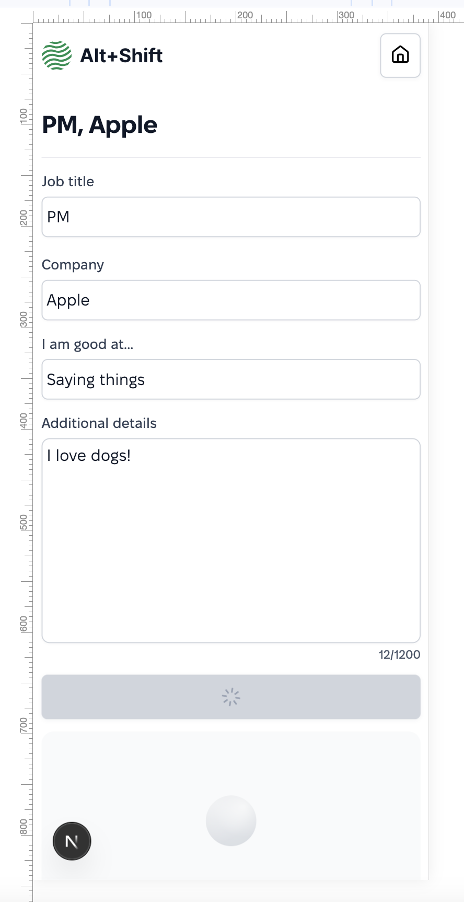
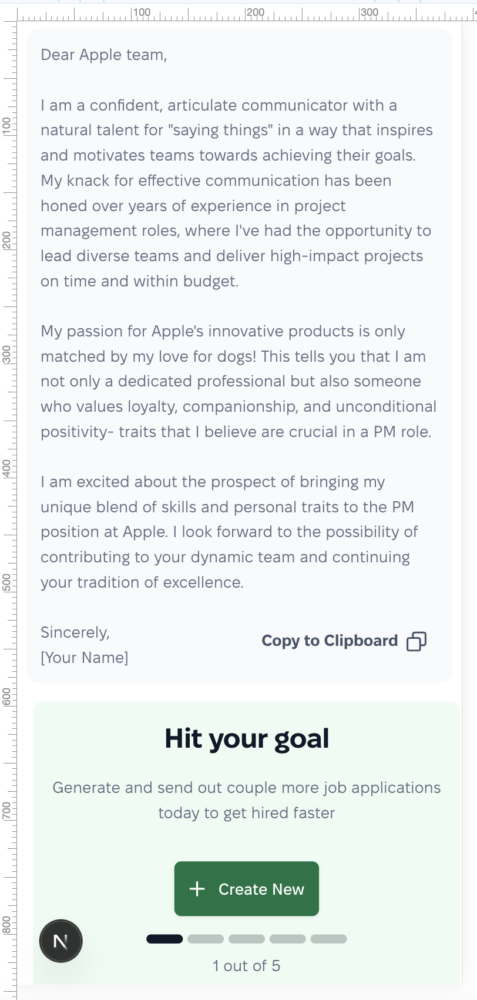
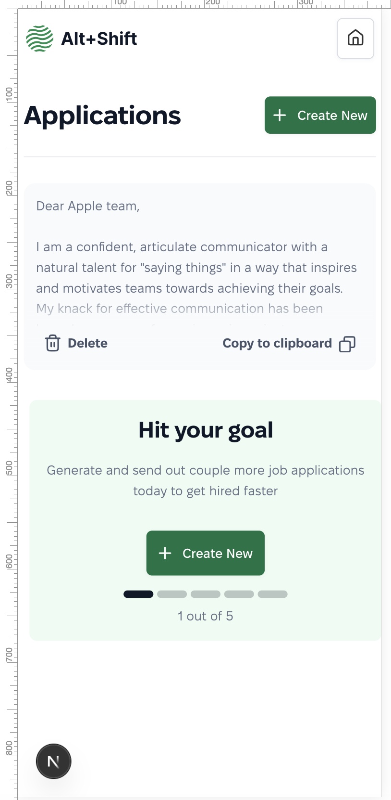
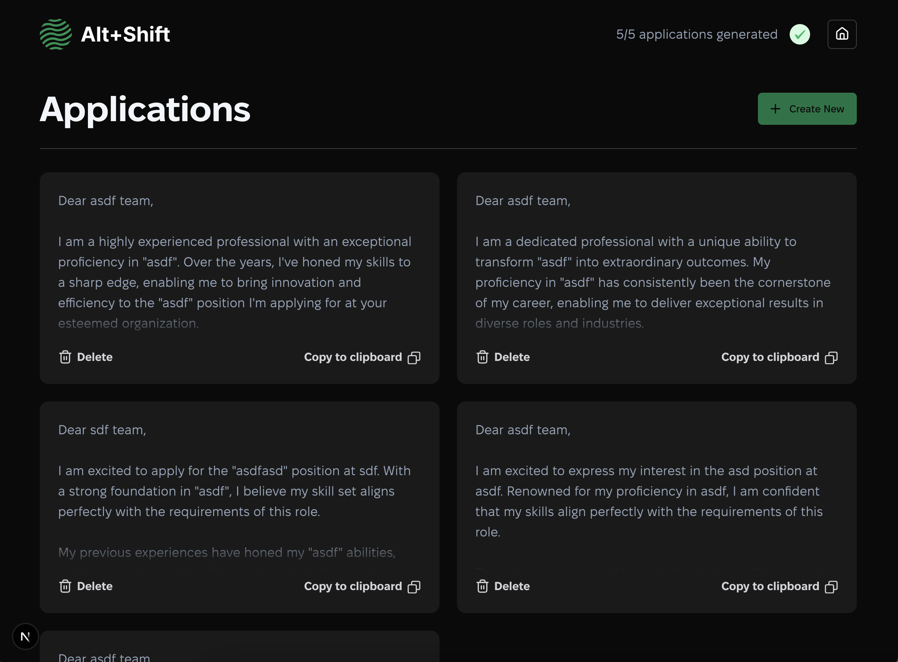
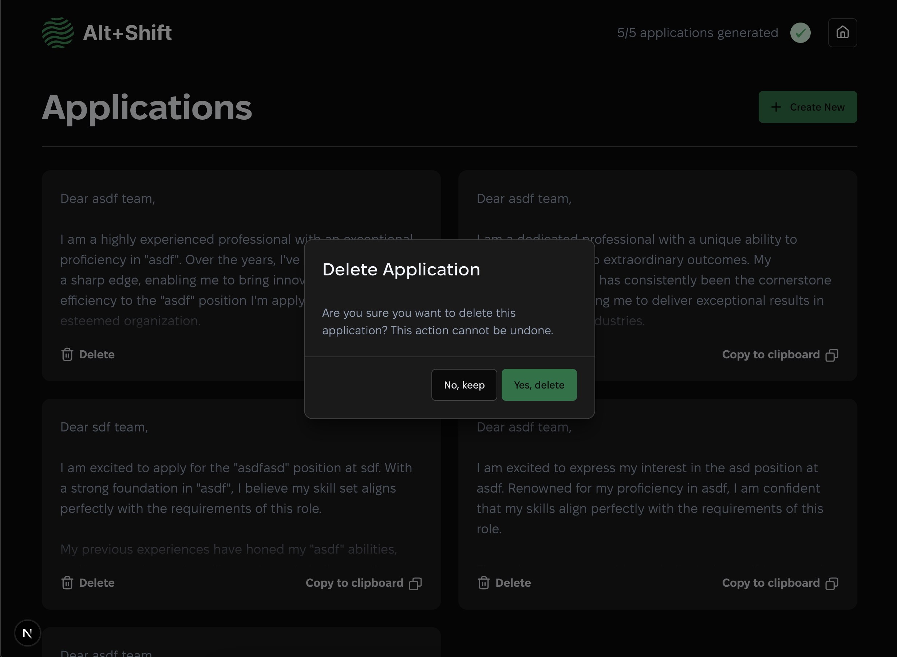
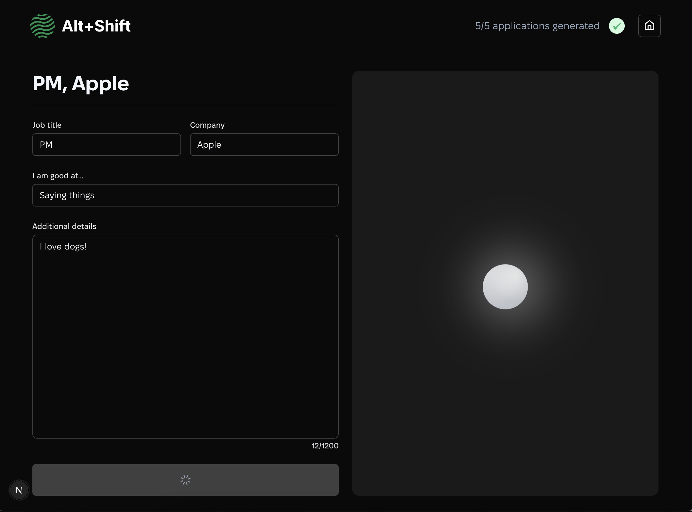
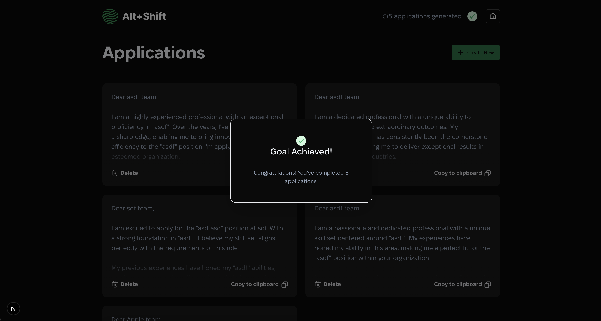
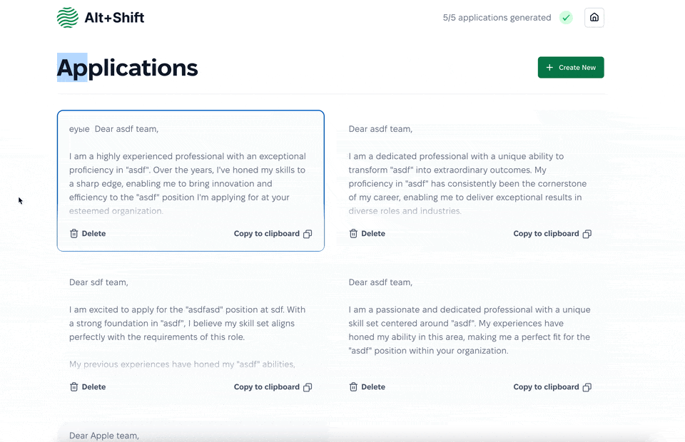

### Детали

> Задеплоено сюда https://cover-letters-two.vercel.app/applications

**Что бы я сделал в дополнительное время (TODO). Если для корректной оценки нужно это реализовать – сделаю:**

> - По хорошему, нужно было бы спользовать scss для миксинов и прочего. В данном случае предпочел более минималистичный подход со своими трейдофами.
> - Я предпочитаю mobile first (двигаться вверх по резлюшенам), но полный дизайн был на десктопе поэтому я прредпочел desktop first для этого случая
> - Разгрузил бы хуки – они несколько объемные.
> - Может, использовал бы что-нибудь для формы вроде react form или формика.
> - ~~ zod для валидаций ~~
> - ~~Есть места, где можно было лучше обойтись с версткой, например в features/HitYourGoal/components/HitYourGoalProgress/HitYourGoalProgress.tsx. Похожая верстка в components/shared/ProgressIndication/ProgressIndication.tsx сделана семантичнее.~~
> - Некоторые кастомные компоненты сделал бы изначально генерализовыннм (например, HitYourGoal сделал бы найстрокой ком-та Banner).
> - Тесы фичей. Пока сделаны тесты только на shared компоненты – просто для примера.
> - ~~Назвал бы через константу какие-нибудь сложные кондишены вроде {initialApplications.length > 0 && (state.applications.length > 0 || !state.isHydrated).~~
> - ~~Где-то есть трехэтажный тернарник – его бы тоже поправил.~~
> - ~~Захардкоженый текст вынес бы в константы аля i18n или просто в .ts файл, если не нужен перевод.~~
> - ~~Дублирующиеся типы (SavedApplication и др.) вынес бы в types/index.ts.~~
> - ~~Не очень консистентно используются глобальные переменные типа RECOMMENDED_AMOUNT_OF_APPLICATIONS – точно где-то просто использую 5ку~~

- Задача приложения — замотивировать пользователя создать хотя бы 5 писем. До тех пор пока писем меньше, отображается баннер их с текущим числом.

> Можно и больше – UI поддерживает, просто после пяти уже не мотивирует пользователя.

- Приложение не имеет какой-либо серверной базы данных, но должно уметь восстанавливать сопроводительные письма, которые были созданы в этом же браузере. Если закрыть вкладку и открыть снова — список созданных писем должен быть таким же.

> Тут сделано как комбинация кук и localStorage. Куки – чтобы хранить кол-во писем и пререндерить карточки и значения. Локал сторадж – чтобы хранить содержимое.

- В макетах специально не используется никакой дизайн-системы или готового React UI kit-а. Поиск закономерностей, систематизация компонентов и стилей — одна из ключевых частей тестового задания.

> Использованы css-модули, css-переменные и classnames-хелпер. Компоненты, которые подразумевались как генерализованные, лежат в /shared папке. Остальное – в фичах, где используются.

- В макетах отсутствует мобильная версия — вам нужно создать ее самостоятельно.

> **Сделано**

### Дополнительные задания (optional)

- Симулировать долгую (2-3 сек) генерацию текста и показать состояние загрузки

> **Сделано**

- Внедрить AI для написания писем. Подключиться к API OpenAI (или другому на ваше усмотрение), создать prompt и связать его с данными формы, чтобы, вместо использования статичного шаблона, модель писала динамические тексты.

> **Сделано**

### Стек

Обязательно использовать React и TypeScript. Желательно **не** использовать Tailwind.

> **Сделано**

Остальное — на ваше усмотрение.

**Дополнительный функционал:**

> - **SSR**
> - **Мобильная версия**
>
>   

> - **Нотификации через Toast компонент** – без них как-то непонятно, завершено ли действие с успехом.
> - **Темная тема**, которая включается при соответствующих настройках компьютера.
>
>  >  >  > 

> - **Abort controller для запросов на ChatGPT** – это нужно, чтобы лишнего не генерировалось, если покидаешь страницу.
> - **Изменение сопроводительных писем из списка** – довольно нужная функция.
> - **Навигация через табы и клики по space**. Я протестил весь путь.
>   
> - **Кое-какие семантические нюансы** через article/section/aside/header и т.д.
> - **Фавикон**
> - **Диалог о завершении задания** "Goal achieved"

## На что мы будем обращать внимание при проверке

- Понятность и масштабируемость кода
- Понимание дизайна и внимание к деталям
- Соответствие макету

> **Изменения, которые я внес:**
>
> - Нет кнопки Home у лого – думаю это сделано по ошибке
> - Loading анимация происходит в disabled состоянии (в дизайнах кнопка enabled)
> - Некоторые отступы вроде 18px или 28px заменены на консистентные – ближе к материаловскому шагу по 4px
> - Добавлена кнопка "Generate New" возле "Try Again" – мне показалось удобным иметь возможность как продолжить без сохранения "Try Again", так и пойти дальше.

- Качество верстки и адаптивности
- Понимание React и следование best practices
- Структура проекта
